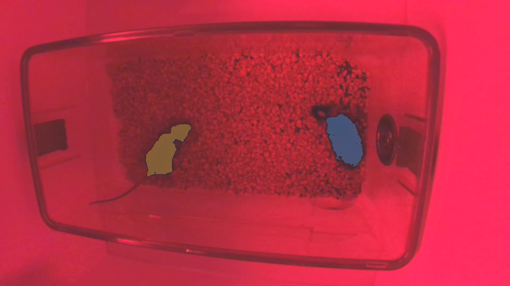
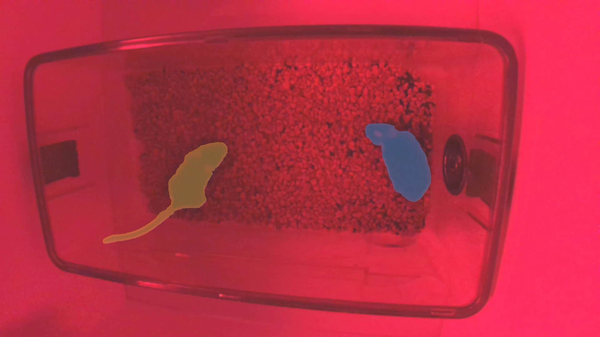

# Agent E2E (A100-80GB shared profile)

Project: `sandbox_Home-Cage-Interactions-0126-test-day`  video: `1A_video_test1a_20260130_090255.mp4`  frame: 160

Prompt: Segment the two dark mice.

LLM: `{"provider":"vllm","model":"Qwen/Qwen3-VL-8B-Instruct","base_url":"http://127.0.0.1:8001/v1","profile":"a100","local":true}`

Tool calls: 7

## Ground truth (drawn from dark pixels, not the agent)

On this red-light frame the mice are the two darkest interior blobs (`lum < 50`). The circular water-bottle port on the far-right wall is a third, smaller dark fixture — not a mouse.

| Identity | Side | Center x,y | Dark area px |
|---|---|---|---|
| NoShave | left | 0.324, 0.527 | 16220 |
| HeadShave | right-of-center | 0.677, 0.487 | 17782 |

The previous E2E “pass” (HeadShave cx=0.783) was the water port. `text_segment "dark mouse"` already returns both animals (cx 0.276 and 0.663); the old `cx > 0.70` check rejected the real right mouse and told the agent to click ~0.80.

## Passing evaluate (frame 160)

| ID | Name | Center x | Area px | Dark-blob IoU | Overlay |
|---|---|---|---|---|---|
| 2 | NoShave | 0.275 | 25243 | 0.643 vs left | gold, body + tail |
| 1 | HeadShave | 0.662 | 29647 | 0.600 vs right | blue, body |

Context dump: `reports/agent-runs/20260816-175911/`

## Screenshots

### Ground-truth dark blobs

### SAM3 `text_segment "dark mouse"` (no LLM)

### 04-after-inspect

### 05-after-segment

### 06-final

