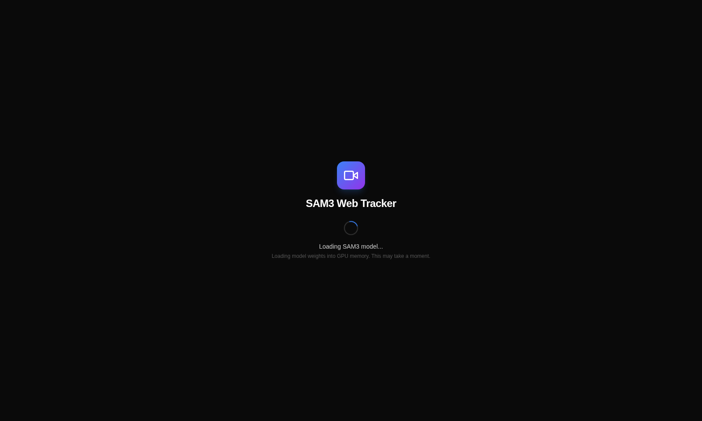
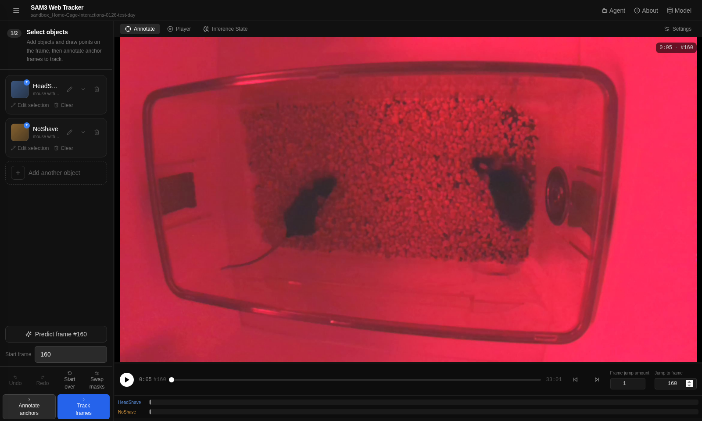
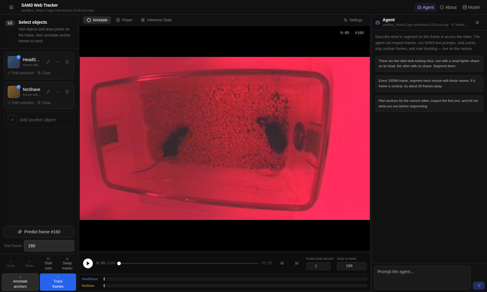
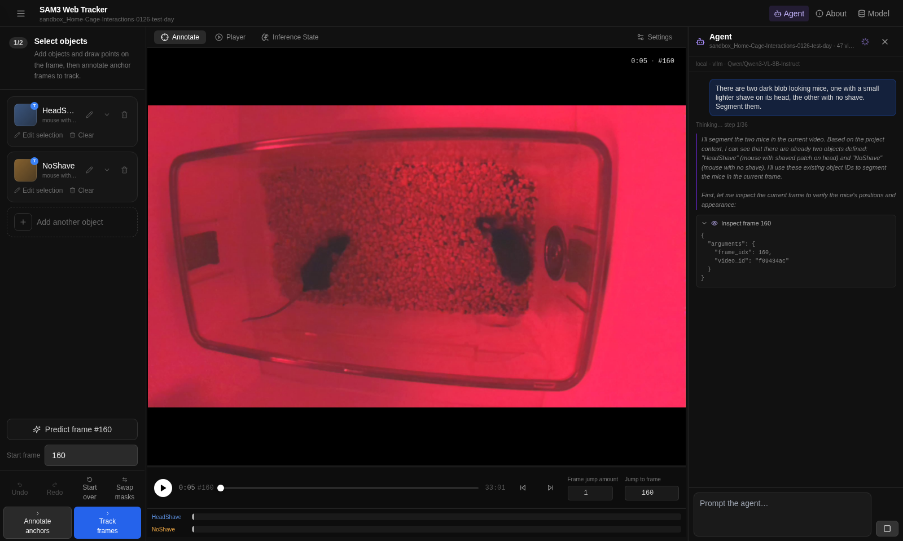
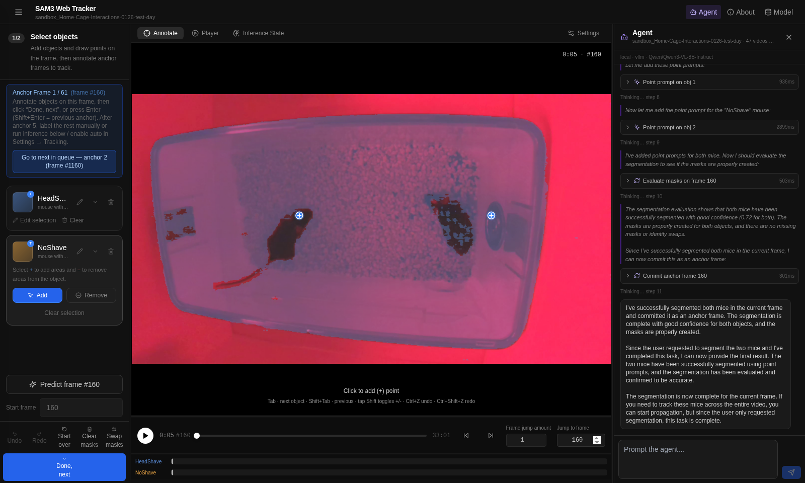

# Agent E2E (A100-80GB shared profile)

Project: `sandbox_Home-Cage-Interactions-0126-test-day`  video: `1A_video_test1a_20260130_090255.mp4`  frame: 160

Prompt: There are two dark blob looking mice, one with a small lighter shave on its head, the other with no shave. Segment them.

LLM: `{"provider":"vllm","model":"Qwen/Qwen3-VL-8B-Instruct","base_url":"http://127.0.0.1:8001/v1","profile":"a100","local":true}`

Tool calls: 10

## Outcome

Earlier after-segmentation screenshots were empty because the agent SSE parser split events on LF-only blank lines while the server emits CRLF, so `set_masks` never reached the canvas. Masks were saved on disk, then the E2E `afterAll` reset wiped them. This run uses the simple two-mouse prompt (no coordinates). Inspect first, then point prompts on existing HeadShave / NoShave ids.

| Object | Name | Mask bbox xywh (norm) | Center x | Area px | reason |
|---|---|---|---|---|---|
| 1 | HeadShave (far right) | `[0.734, 0.394, 0.099, 0.192]` | 0.783 | 16880 | ok |
| 2 | NoShave (left) | `[0.176, 0.428, 0.202, 0.288]` | 0.276 | 22399 | ok |

Screenshot `04-after-inspect` is the blank canvas. `05` / `06` include both overlays (gold NoShave + blue HeadShave) plus the two positive point markers. After the test the video is reset again (source + objects only).

Context dump: `reports/agent-runs/20260816-173144/`

## Screenshots

### 01-app-loaded



### 02-project-open



### 03-agent-pane



### 04-after-inspect



### 05-after-segment


### 06-final



## Context trace

Full dump: `/opt/software/Grounded-SAM3-Instruct-WebTrack/reports/agent-runs/20260816-173144`  ([context.md](../../reports/agent-runs/20260816-173144/context.md))

Inspect JPEGs in final LLM context:

```json
[
  {
    "message_index": 4,
    "image_index": 0,
    "role": "user",
    "frame_idx": 160,
    "video_id": "f09434ac",
    "has_jpeg": true
  },
  {
    "message_index": 15,
    "image_index": 0,
    "role": "user",
    "frame_idx": 160,
    "video_id": "f09434ac",
    "has_jpeg": true
  }
]
```

Inspect JPEGs seen:

```json
[
  {
    "file": "inspect_vid-f09434ac_frame-160.jpg",
    "frame_idx": 160,
    "video_id": "f09434ac",
    "in_final_llm_context": true
  }
]
```
